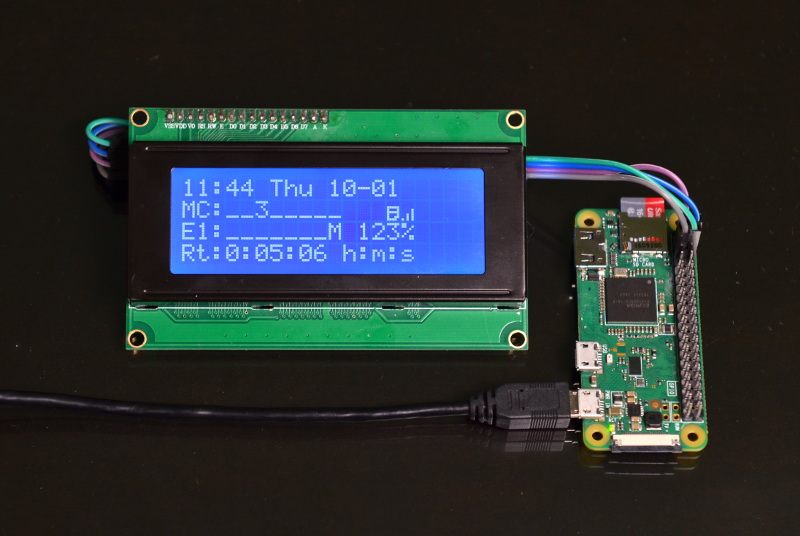
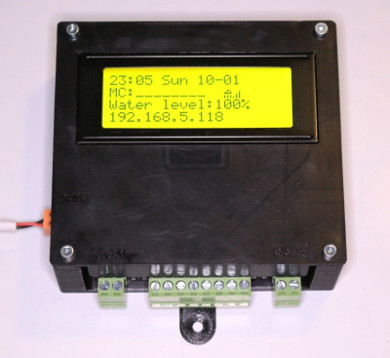
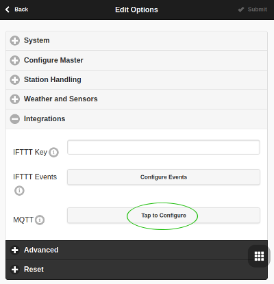
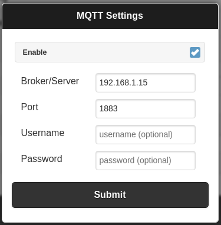
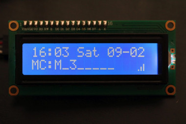

# ospiLCD-mqtt.py

This python script monitors an OpenSprinkler station and displays its status on an I2C LCD as events occur by using MQTT. It can be run on the OpenSprinkler controller itself (if it is the Pi version), or on a separate Rasperry Pi as a remote status display as shown below. 

*Example status display, run on a Raspberry Pi Zero W*



**Features:**
* 16x2 and 20x4 I2C LCDs are supported (PCF8574T based, after some changes MCP23008 is supported too)
* The first two lines are identical to LCD on OpenSprinkler 2.x (with icons)
* Third and fourth lines display information based on ospi status (remaining watering time, water level in %, E1 stations status)
* LCD updates immediately when a status change occurs on the OpenSprinkler system (e.g. a station starts/ends) without needing to poll the API.
* LCD backlight can be configured to be on all the time, or to automatically turn on when showing a new status then turn off after a configurable timeout. 
* Can be used as remote OpenSprinkler LCD display, or on a OpenSprinklerPi system. 
* Runs well on all current Raspberry Pis (2, 3, 4, Zero W)

 This project is based on code from Stanley's excellent build at https://github.com/stanoba/ospiLCD. Please refer to his project for designs for 3D printed case, pcb designs, and other build tips. *(Shown to the right, a _4 line LCD status display, built into OpenSprinkler Pi, using Stanley's build)*

This ospiLCD-mqtt version makes two functional changes from the ospiLCD project that are important to note up front:
* It subscribes to an MQTT server to receive immediate notifications of OpenSprinkler events, then uses the OpenSprinkler API to gather current data.
* Rather than a "one shot" script that runs from a cron job, this script runs ongoing in a service loop, responding to events as needed. 

In this README, we'll walk through two general parts to the setup, 
1. Setting up the Rasperry Pi with the LCD display and the software
2. Setting up MQTT notifications.

# Setup and Installation

## Installing the LCD Display
Use an I2C LCD display module supported by the RPLCD library. Details about what display modules are supported, and how to wire the LCD to the Raspberry Pi are well documented in the [RPLCD library docs, here.](https://rplcd.readthedocs.io/en/stable/getting_started.html) 

If you would like to install directly onto the OpenSprinkler Rasbperry Pi, follow [Stanley's instructions, here](https://github.com/stanoba/ospiLCD.)
 

## Installing the Display Software
Starting with a recent installation of Raspbian or Raspbian Light, here are steps to install the libraries and code needed:

First, configure the Raspberry Pi to connect to your network, which needs have access to the OpenSprinkler system and the MQTT server you will be using. 

 Then use `apt` to install pip, smbus, and i2c tools:

    $ sudo apt update
    $ sudo apt upgrade -y
    $ sudo apt install python-pip python-smbus i2c-tools

Install RPLCD, netifaces, and paho-mqtt libraries directly from [PyPI](https://pypi.python.org/pypi/RPLCD/) using pip:

    $ sudo pip install RPLCD
    $ sudo pip install netifaces
    $ sudo pip install paho-mqtt
  

Install ospiLCD script from github:

    $ cd /home/pi/
    $ wget https://raw.githubusercontent.com/sirkus7/ospiLCD-mqtt/master/ospiLCD-mqtt.py
    $ chmod +x ospiLCD-mqtt.py

## Install/Setup a MQTT broker
OpenSprinkler has built in support for MQTT, which is a lightweight messaging protocol used by many IoT devices to communicate status and updates. There are a number of popular cloud based MQTT services available that you could use, if you don't want to run your own. Or, you can easily run an MQTT server on your Raspberry Pi, or a Linux system on your network. If you would like to use a cloud based MQTT broker, skip this section and proceed to the next section. 

Install the "mosquitto" MQTT broker on your Rasbperry Pi (or another Linux system on the network.)

    $ sudo apt install mosquitto

The installation should automatically start the mosquitto MQTT broker service, as well as create service startup scripts to ensure it starts up on system boot. Quite helpful.

To double check that mosquitto process is running, you can use `ps`:

    $ ps -e | grep mosquitto 
    10806 ?        00:00:00 mosquitto

Now, you need to get the IP address of your new MQTT broker in order to tell your OpenSprinkler system where to find it. You can get this using the following command:

    $ hostname -I

Take note of the first part of the resonse, the IPv4 address of your Raspberry Pi, so you can ou'll use this to configure your OpenSprinkler system.

## Configure OpenSprinkler System to use MQTT
In the OpenSprinker UI, configure the MQTT server (broker) information. Do this by clicking on the multi square icon in the bottom right, and choosing "Edit Options", then select the "Integration" section (shown below, left). Find MQTT and click "Tap to Configure" next to it. 

1: OpenSprinkler Edit Options, Integration | 2: MQTT Settings
----------------------------------------|---------------
 | 

Fill in the IP address of the MQTT server (shown above, right). If you're using the mosquitto server, the default port is 1883. If your server requires username and passowrd, enter it. The default mosquitto server described above doesn't require any -- you can leave them blank.

Click submit, and return to the main screen. 

## Configure ospiLCD-mqtt.py
Edit the `ospiLCD-mqtt.py` file:
    $ nano ospiLCD-mqtt.py
  
Find the "Configuration Parameters" section near the beginning of the file, and set these appropriately for your setup. 
```python
################ Configuration Parameters ####################
# Set OpenSprinkler system info (address, port, password hash)
osAddress = "ospi.lan"  # IP Address or hostname of the opensprinkler system
osPort = 8080  
md5hash = "a6d82bced638de3def1e9bbb4983225c"  # OpenSprinkler password MD5 hash (default opendoor)
# Set MQTT info (defaults to localhost, if MQTT server is running on Pi)
mqttAddress = "127.0.0.1"
mqttPort   = "1883"
# Set I2C LCD Info
LCD_i2c_expander = 'PCF8574'  # PCF8574 (default, ebay), MCP23008 (used in Adafruit I2C LCD backpack) or MCP23017
LCD_i2c_address = 0x27  # LCD I2C address (default 0x27)
LCD_cols = 20  # LCD columns (16 or 20)
LCD_rows = 4   # LCD rows (2 or 4)
backlight_timeout = 60.0 # Float, seconds to keep display lit after showing data before dimming. 0.0" Disables, keeps backlight on at all times. 
# Set Raspberry Pi System Info
date_locale = 'en_US.UTF-8'  # Set to your Raspberry pi locale eg. 'en_GB.UTF-8' or 'it_IT.UTF-8'
net_iface = 'wlan0' # Set to network interface used for communication (eg. wlan0, eth0)
```
The osAddress must be set to your OpenSprinkler IP address, and this address must be accessable to your Raspberry Pi. If you're running 'ospiLCD-mqtt.py' on the OpenSprinkler Pi, then you can set this address to "127.0.0.1" refering to itself. 

Similarly, if you're running the MQTT server on the Raspberry Pi as we did in these instructions, the defaults for the MQTT settings shown above will work fine. You can use the either address identified earlier, or you can use 127.0.0.1, refering to the local Raspberry Pi. If you're running the MQTT server elsewhere, or if you're using another MQTT server or cloud service, enter the address and port for that service here. 

## Run ospiLCD-mqtt.py
Now we're all ready to to run:

    $ ./ospiLCD-mqtt.py

## Troubleshooting
When `ospiLCD-mqtt.py` is run, the the LCD Screen should should light, briefly indicating it is subscribing to OpenSpinkler messages on the MQTT server:

    Connecting to
    MQTT broker...

If it cannot connect to the MQTT server, it will stay on this message indefinately. In this case, check the MQTT server settings in `ospiLCD-mqtt.py`and then try again.

If it successfully connects to the MQTT broker, it will display the following message:

    MQTT Connected
    Requesting Info

If it stays on this message, this means it either cannot connect to and query the OpenSprinkler system API, or the OpenSprinkler system is not able to connect to the MQTT server. In this case, double check the MQTT related parameters in `ospiLCD-mqtt.py` and in your OpenSprinkler system, and then try again. 

If all is successful, the above messages will only be shown briefly as it successfully subscribes to MQTT messages, queries the OpenSprinkler status, and then formats and displays the status LCD display, such as below: 



Congrats!

# Helpful References
* Stanley's ospiLCD project: https://github.com/stanoba/ospiLCD
* RPLCD Library Documentation: https://rplcd.readthedocs.io/en/stable/index.html
* Open Sprinkler API Documentation: https://openthings.freshdesk.com/support/solutions/articles/5000716363-os-api-documents
 
